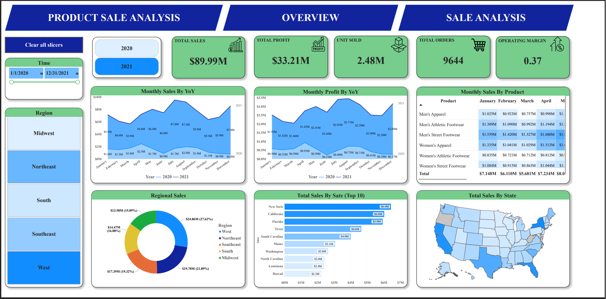
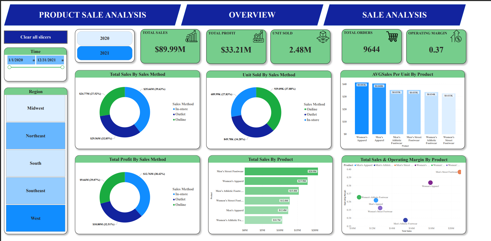

# 🏀 Sport Product Sales Analysis

## 📌 Overview

This project analyzes sport product sales performance using Excel and Power BI.
The goal is to uncover key business insights across products, regions, and sales channels through interactive dashboards.

---

## 📊 Dataset

* Source: Excel dataset
* Data includes: Product, Region, Sales, Profit, Orders, Sales Channel
* Data cleaning & transformation performed using **Power Query**

---

## ⚙️ Tools & Technologies

* **Excel** – Data source
* **Power BI** – Data visualization & dashboard development
* **Power Query** – Data cleaning and transformation

---

## 📊 Dashboard Preview

### 🔹 Dashboard 1 – Overview Analysis

This dashboard provides a high-level view of business performance:

* Key KPIs: Total Sales, Profit, Unit Sold, Operating Margin
* Monthly Sales & Profit trends (YoY comparison)
* Regional sales distribution
* Sales performance over time

---

### 🔹 Dashboard 2 – Product & Sales Analysis

This dashboard focuses on deeper business insights:

* Sales breakdown by product category
* Performance by sales channel (In-store, Outlet, Online)
* Profit and units sold by channel
* Average sales per unit and operating margin by product

---

## 📈 Key Insights

* Total sales reached **$89.99M** with strong profitability
* **Men's Street Footwear** is the top-performing product category
* The **West region** contributes the highest revenue share
* **In-store sales channel** dominates overall revenue
* Sales and profit show consistent growth trends over time

---

## 🚀 Project Highlights

* Built an end-to-end data analysis workflow from raw Excel data
* Applied data cleaning techniques using Power Query
* Designed interactive and user-friendly dashboards in Power BI
* Delivered actionable business insights from sales data

---

## 📄 Full Report

[Download Dashboard PDF](Sport_Products_Sales_Analysis/Dashboard.pdf)

---

## 👤 Author

**Minh Khổng**

* Aspiring Data Analyst
* Skills: Power BI, Excel, Data Analysis

---
